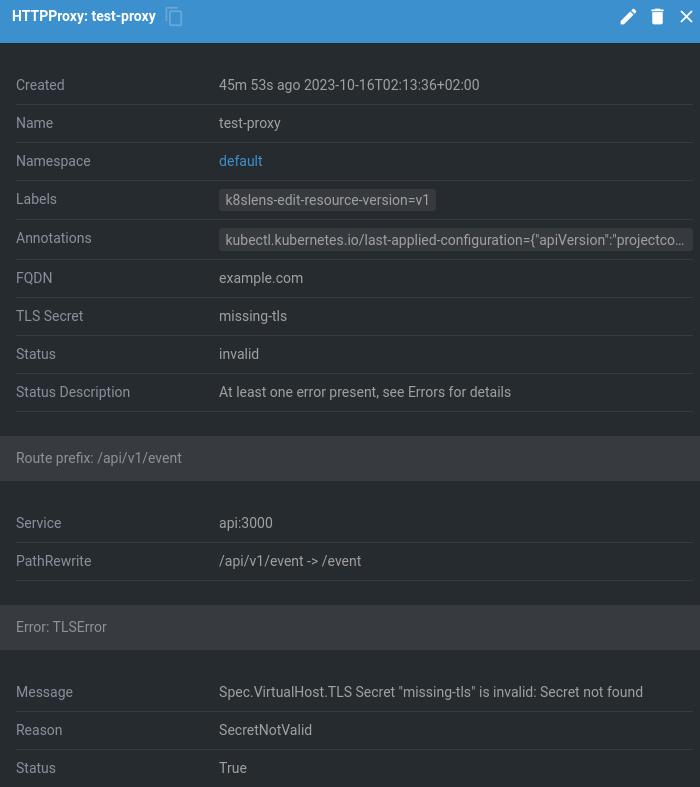

# lens-extension-httpproxy-info

See additional data from HTTPProxy inside info.

## Installation

### Direct link to Lens

[lens://app/extensions/install/lens-httpproxy-info](lens://app/extensions/install/lens-httpproxy-info)

### Manual installation

Menu > Extensions and search for `lens-httpproxy-info`.

### Alternatives downloads

#### Github
https://github.com/nefelim4ag/lens-extension-httpproxy-info/releases/latest/download/lens-httpproxy-info.tgz
